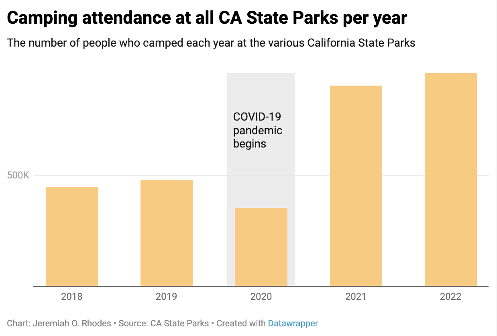
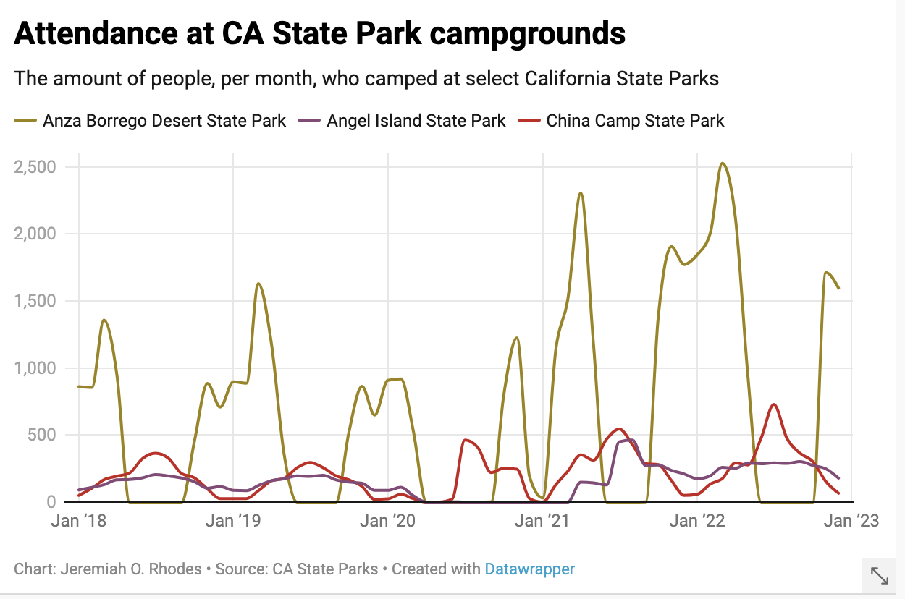
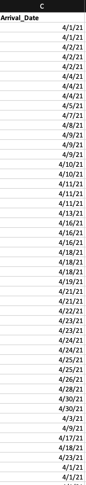
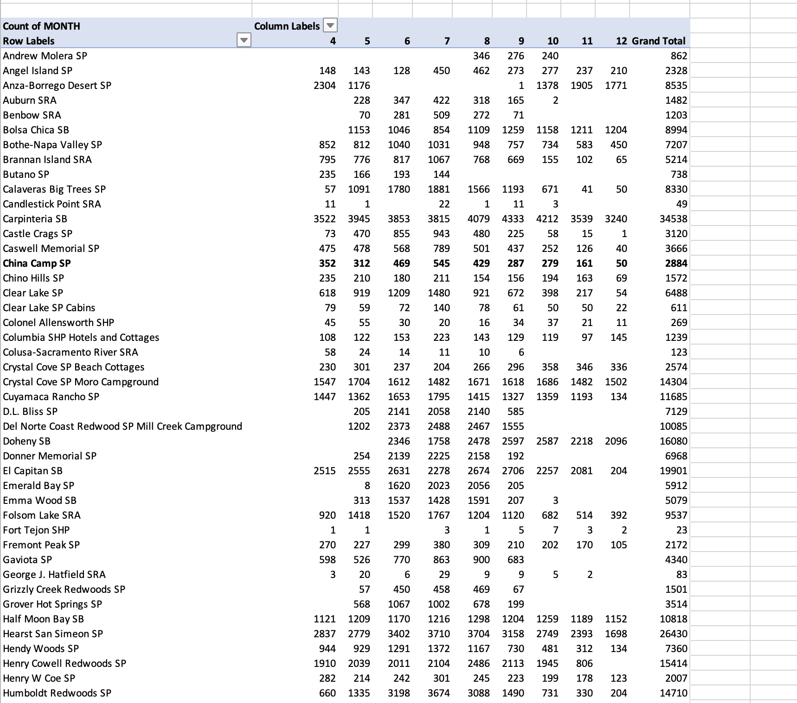

# As summer approaches, California's state parks prepare for a rush of visitors
## Jeremiah O. Rhodes
### Each year, millions of people from all over the world come to visit California's over 200 state parks. As summer months approach, Park employees prepare for the rush.

Maggie Fuller’s first memory at a California State Park was on an elementary school field trip to Año Nueve State Park, located just west of San Jose. 

While Fuller doesn’t remember every detail about the trip, she remembers seeing the elephant seals vividly.

“I remember looking at these giant animals and just thinking, ‘that is so much bigger than I am and so scary,’” Fuller said. 

She also recalls the sunset’s vibrant colors.

“You get this really liquid gold light. It’s always been one of my favorite field trip memories.”

Fuller, now 34 and a graduate student at the UC Berkeley Graduate School of Journalism, says that those memories made a huge impact on her.

“I think I kind of chase those memories a lot, that golden light that I remember.” 

Fuller is just one of the 68 million people who visit California’s 280 state parks each year. 

The CA state park system dates back to 1864, when Yosemite became the first state park in the country. 

Since then, California has become the state with the most state parks in the US. 

The parks, aside from their natural beauty, also serve as educational sites for people to learn more about the state. 

Fuller remembers Angel Island State Park being one of those parks. 

On the island, hundreds of thousands of immigrants, mostly from Asia, were detained and interrogated before continuing on the path toward US citizenship. Many immigrants were kept on the Island for months, away from the mainland of San Francisco, close enough to desire but just out of reach. 

It was during a field trip to Angel Island that Fuller first came face-to-face with the darker past of the state she loved so much.

“California felt so liberal growing up, every bad thing felt so far away,” Fuller said. “I remember being on Angel Island, which is a beautiful park, and just thinking, ‘there were atrocities committed here.’ The way this city I loved so much treated humans is despicable and appalling.”

## Along with the attractions for visitors is an extensive network of park employees and volunteers

Along with the various opportunities for visitors, California’s State Parks system employs thousands of people to help the parks run. 

Greg Martin has been working full-time for California State Parks since 2000. Originally from the Central Valley, he was introduced to the parks when he was in college at Cal State University, Stanislaus. Martin volunteered at a park while in college and fell in love. 

23 years later, Martin is the Desert Division Chief for California State Parks, managing several groups of State Parks throughout the state.

As division chief, Martin oversees each of the park’s moving parts. 

“I like to compare a state park to a city,” Martin says. “We have our own public works department, so in many parts we treat our own water and sewer. We also have our own electrical systems, sewer systems, roads, all of that.”

Each fall and winter, various California state parks begin preparation for the rush of visitors who come during the summer months. 

There are various steps that the parks take to prepare for the summer months, including hiring and training seasonal staff, bringing in volunteers, contracting out work beyond the scope of park employees, setting up lifeguard towers and budgeting for increased need of housekeeping supplies.

While each year has its peak months, COVID-19 was a different story. 

Attendance at California State Parks has skyrocketed since the pandemic first hit the US in March 2020. 

Martin remembers that the rush was greater than any of his co-workers expected.

“It was unlike most of us had seen,” he said. One of the big changes he recalled were staffing shortages.

“COVID didn’t just affect the general population. Members of our staff also succumbed to the illness during that time, and other people just had fears about COVID, since most of the staff is dealing with the general public every day,” he said.

While Martin recalls the hectic nature of the increase in park attendance, he also enjoyed seeing more people connect to the places he loves so much. 

“When the malls were closed and shops and restaurants and all of that, there were very few public places that could be used. People wanted to be outside, which is great, and I think that appreciation for being outside is still there.”

As many people head back into the office and COVID restrictions dissipate, attendance at state parks is still higher than pre-pandemic numbers, affirming Martin’s belief. 

Today, Maggie Fuller doesn’t get to spend as much time at State Parks as she did when she was a kid. She says that most of the friends she went with have since moved away. 

Despite changes in her own attendance, she finds joy in helping new friends of hers, many from other places, fall in love with the various state parks. 

“I’ve got friends who are driving to LA this summer and I have my long list of state parks and beaches that I told them they have to drive through,” Fuller said.

Some of the parks she suggests are Angel Island State Park, Anza Borrego Desert State Park and China Camp State Park.

Though Fuller doesn’t visit state parks as often anymore, she doesn't see her journey with them as over, but evolving as she does.

“Because I’ve lost the people who usually get me into the outdoors, I’ve started looking for that more in the people that I’m potentially dating. When I’m looking online, seeing someone who looks like they go camping or has anything like that on their profile is definitely a plus.” 

When looking longer-term, Fuller expects her relationship with the Parks to continue to evolve with her.

“I kind of can’t wait until the day I have a family of my own that I can introduce to the parks. It’s always an evolving thing and I can’t wait for the next phase of it.”

# Data Anaylsis/Diary

Questions to ask in data
1. How many campers in each park per month? 
2. What were the months with highest attendance
3. What are the most popular state parks?
4. How did park attendance change after the start of the pandemic?
5. What was the month-to-month attendance for the parks mentioned in my story?

## Process
The data came in various spreadsheets, broken up by year. 

1) The first thing I noticed was that the format of the dates isn't enough for me to extract each month. To fix this, I changed the date column formate to month/day/year.

### [Link to visualization](https://datawrapper.dwcdn.net/cwHP3/1/)

2) The next thing I needed was to separate the month from the day and year of each cell, since I only need the month. To do that, I made another column and titled it "MONTH." I used a formula: =month(cell number) to create a number that corresponds to the month (1 is January, 2 is February, etc.)

3) Next, needed to get a count of each month for each park. To find the count for each park, I made a pivot table for each dataset. In that table, I specified the the columns as the "park" column and "MONTH. For the values, you'll do a "count." That gave me the count for each month, and allowed me to do all of my data analysis.

4) NOTE: Because some of the files for the eyars were split between Q1 and then April-December, or for Jan-June and July-Dec (not sure why it was sent to me that way,but you work with what you got), to determine total attendance for the year, I just added each of the Grand Total cells for that year. (I just did the formula to add the grand total for the 2021 Q1 file and the grand total for the Apr-Dec file).

# Sources: 

1. Andrew Lopez: student at UC Berkeley's Graduate School of Journalism. Andrew grew up in California and grew up going to various CA State parks with his family. He could serve as the narrative backbone, helping the reader get a feel for what CA State Parks mean to people.
- email address is andrew_lopez@berkeley.edu
2. Maggie Fuller: UC Berkeley students. She also grew up camping in CA state parks and has a deep relationship to them. Similar to Andrew, she could also add narrative elements to move the story along. If I end up talking to them both, I'll decide which one to use after.
- email address is mfuller@berkeley.edu
3. Jorge Moreno: Information Officer for CA State Parks. He can help put me in touch with someone who works for the State Parks to talk about how they prepare for the summer and the affects COVID had on park attendance.
- His phone number is (916) 661-2598.

